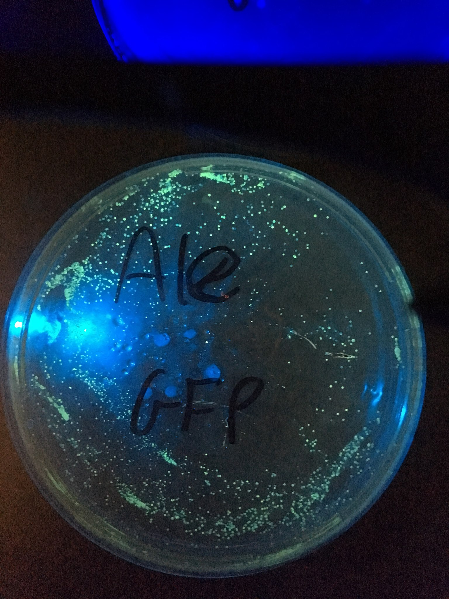

# EngineeredBeer

Plans for genetically engineering yeast. The goal is a simple starter in genetically engineering your first microbe using commercial off-the-shelf components.

Short version of The-Odin's [document to engineer yeast](https://docs.google.com/document/d/1RglbyLkZX4FRkkXWGc7PlLX41RRd_bnptrY8-Iu4x44/edit)

Kits are sold [here](http://www.the-odin.com/genetically-engineer-any-brewing-or-baking-yeast-to-fluoresce/)

Or skip the hard work, premade Fluorescent samples are available [here](http://www.the-odin.com/preengineered-fluorescent-brewing-and-baking-yeast/)

# Overview
Brewing glow-in-the-dark beer with genetically engineered yeast via a plasmid that contains the jellyfish gene which allows it to fluoresce. At a high level we are trying to convince yeast to take a plasmid with the gene that we want it to express. The plasmid is a small circular piece of dna with a few characteristics, it contains the green fluorescent protein dna and an antibiotic gene.

When working with genetics for this experiment, we rely on a few techniques to get the job done:
 1. Getting the dna into the yeast, called 'transformation'
 1. Convincing the yeast to uptake the new gene
 1. Selecting the yeast that took your gene from the rest of the yeast

# Ingredients
What you need, and why you need it.
 - Brewers/Bakers yeast (Saccharomyces cerevisiae)
 - Agar: for cultivating the yeast
 - Yeast GFP Expression plasmid w/an antibiotic gene
 - Yeast transformation buffer: for getting the plasmid into the yeast
 - Agar w/an antibiotic: for selecting engineered yeast

# Process
## Create a medium for yeast to grow on
We use a special type of agar called YPD agar, which contains Yeast Extract, Peptone, and Dextrose, which will let us inhibit bacteria and grow yeast faster.
 
The process is like making jello. Mix the agar with water in a glass container and microwave it in short intervals, paying close attention to not make a huge mess in your microwave. Pour the liquid into plates so it just covers the bottom of the plate. Let it cool. Store upside down so the condensate doesn't drip down.

Will will need to make at least one plate YPD agar and one plate of YPD agar with the antibiotic.
 - [ ] Add 6.25g of agar to 125ml of water in a microwave safe container
 - [ ] Shake to dissolve
 - [ ] Microwave in 30 second increments for 1-3 minutes until dissolved
 - [ ] Pour mixture into plates so they barely fill the bottom
 - [ ] Let cool overnight on a table
 - [ ] After cool, store in fridge upside down

## Adding new DNA
We need to make the yeast in a state that will accept our plasmid. Newly growing yeast is the best, so we need to rehydrate our yeast and put it on the plate to start growing.  After we see some growth, we will place it into a tube for transformation. We add the plasmid and the transformation buffer, which will weaken the cell walls and it contains other things to help the plasmid pass into yeast cell. We heat shock this mixture to force the yeast into a heat shock response mode, which will cause the yeast to undergo a physiological change. We then add it to a tube with water and agar to allow it to recover. We then strike it on an antibiotic plate and wait for the results.

###Growing the yeast
 - [ ] Add yeast to a tube with water, shake until dissolved
 - [ ] Streak 100uL of the yeast solution onto a plate
 - [ ] Let yeast grow for 12-24 hours
### Adding the gene
 - [ ] Add 100μL yeast transformation mix to a microcentrifuge tube
 - [ ] Scrape some yeast (around 2 loopholes) and add it to the tube, stir until dissolved (pipette up and down) (can be stored at 4C)
 - [ ] Add 10μL of Yeast GFP Expression Plasmid to your 'competent' mixture
 - [ ] Incubate in 108F water for 1 hour (heat shock)
### Let it recover
 - [ ] Add 1.5ml of room temperature water to a YPD microcentrifuge tube, shake to dissolve
 - [ ] Add 900μL of YPD media to the 'competent' mixture.
 - [ ] Incubate at 86F for 4-6 hours. This allows the yeast to recover. Taping it to your body a easy source of near 86F. I usually put it in my shoe :)
### Pulling out the cells that took your new DNA
 - [ ] Add 400μL of the transformation mixture to a antibiotic plate
 - [ ] Flip plate upside down and incubate at 86F for 1-3 days. It can take longer if it is stored at room temperature.

# Multiplying the yeast
Yeast is generally anaerobic but requires O2 for constructing cell walls. Brewers often shake the wort or use other forms of oxygenation to promote this at the beginning of the brew. We need to multiply enough yeast to brew with. This will take at least a day. 

Repeat the process for multiple tubes to decrease the chance of contamination.
1. Boil 1/4 cup water, 1/4 cup dried malt extract, and a tiny amount of yeast nutrient if available for 20 minutes.
2. Move to a flask or other enclosed container, cool to room temperature in an ice/water bath
3. Shake vigorously to introduce oxygen
4. Let sit at room temperature for 24 hours.
(optional)
5. Cool to drop out the yeast. Separate top layer with yeast cake at the bottom. Add yeast to some falcon tubes and share with friends.